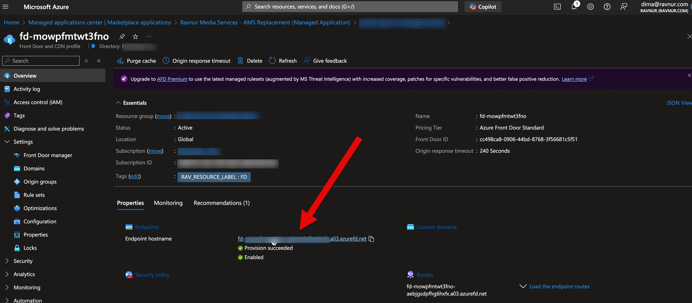

# RMS Streaming Endpoint and CDN

## Overview

By default, an RMS cluster exposes two endpoints for video-on-demand (VOD) streaming:
* [Streaming Origin Endpoint](#streaming-origin-endpoint)
* [Front Door Endpoint](#front-door-endpoint)

## Streaming Origin Endpoint

The Streaming Origin Endpoint is a streaming server load balancer.
The Streaming Origin domain follows this format: `i-rms.{RMS DNS zone}`.

You can find your RMS DNS zone in the Azure portal:

1. Navigate to your RMS resource group

2. In the resource list, use the Type filter and select __DNS zone__

3. The DNS zone resource name is your RMS DNS zone

RMS resource group typically contains a single DNS zone resource.

> **Important:**
> The Streaming Origin Endpoint is public, however, direct usage is not recommended. This method uses the public internet for transport, which causes latency and security issues. Instead, use the [__Front Door Endpoint__](#front-door-endpoint) or a __CDN endpoint__ mapped to the RMS Streaming Origin.
> * If you use Azure Front Door or Azure Standard CDN (classic), Ravnur can configure the private endpoint, and make it not accessible publicly.
> * If you use another CDN provider, the endpoint cannot be private. Our team is actively working on a solution to support private endpoints before the Azure Standard CDN end-of-life on [September 30, 2027](https://learn.microsoft.com/en-us/azure/frontdoor/front-door-cdn-comparison).

## Front Door Endpoint

The Front Door Endpoint provides you with:
* Efficient routing to the Streaming Origin Endpoint using the Azure network, bypassing the public internet.
* Advanced configuration options, such as caching, compression, Web Application Firewall (WAF) rules, and managed SSL certificates for custom domains.

The Front Door Endpoint domain name follows this format: `fd-{unique string}.{AFD DNS subdomain}.azurefd.net`. 
It is the default hostname of the Streaming Endpoint in the RMS Console: 

* If you have already changed hostname, you can locate the Front Door Endpoint in your RMS resource group:

1. Navigate to your RMS resource group
    
2. Look for the resource named `fd-{unique string}`
    
3. This will be the only Front Door resource in your resource group

> **Note:**
> It is not recommended to map your custom CDN/Azure Front Door to the RMS Front Door Endpoint. According to [Microsoft's documentation](https://learn.microsoft.com/en-us/azure/frontdoor/front-door-faq#can-i-deploy-another-cdn-from-an-external-vendor-behind-or-in-front-of-front-door), this is considered a bad practice. 

## Questions and Answers

### Can I enable caching in my RMS Front Door instead of using an additional CDN?

Yes, Ravnur can take care of this. It is the most cost-effective way to set up a CDN for your RMS cluster, with the additional benefit of making the Streaming Origin Endpoint private.

### How to Integrate a Custom CDN with the RMS Streaming Endpoint?

* Map your CDN to the Streaming Origin Endpoint.
* Do not map it to the RMS Front Door Endpoint; according to [Microsoft's documentation](https://learn.microsoft.com/en-us/azure/frontdoor/front-door-faq#can-i-deploy-another-cdn-from-an-external-vendor-behind-or-in-front-of-front-door), this is considered a bad practice. 
* Use the **Ignore Query String** option.
* No other configurations are required.
* [Update the Streaming Endpoint Host Name in the RMS Console](#how-to-update-the-rms-streaming-endpoint-host-name).

### How to Use a Custom Domain with the RMS Front Door?

1. [Create a CNAME record](https://learn.microsoft.com/en-us/azure/frontdoor/front-door-custom-domain#create-a-cname-dns-record) for the alias host domain to point to the RMS native Front Door Endpoint: `fd-{unique string}.{AFD DNS subdomain}.azurefd.net`. Refer to the guidelines to [obtain the RMS Front Door domain](#how-to-update-the-rms-streaming-endpoint-host-name).
2. Submit an [RMS support request](mailto:support@ravnur.com) to add your custom domain name to the RMS Front Door.  When contacting RMS support, provide:
* Your domain name.
* The RMS resource group.
3. [Update your Streaming Endpoint host name in the RMS console](#how-to-update-the-rms-streaming-endpoint-host-name).

### How to Update the RMS Streaming Endpoint Host Name?

1. Go to the RMS Console.
2. Choose your account -> Manage -> Streaming Endpoints.
3. Change the **Host Name** property field and press the **Save** button:
   
   For the old console:
   

> **Note:**
> If your application uses static URLs or stores the streaming domain in its configuration, make sure to:
> 
> * Update all static URLs for streaming links whenever changes are made.
> * Modify the application’s configuration to reflect the updated streaming domain.

### Why Do I Need to Update the Streaming Endpoint Host Name in the RMS Console?

In most cases, your application requests the __RMS API__ to obtain the domain name used in your streaming links. Therefore, you need to update it so your application receives the new domain name when composing streaming links.

If your application retrieves the domain from its own configuration instead of the RMS API, you do not need to update the RMS console. Instead, update your application’s configurations directly.

### What is the Default Cache TTL for RMS Content?

Time-to-live (TTL) functionality allows the database to automatically expire data.

The default cache values are:

* 100 days for VOD content; 

* 6 days for downloads.

[Ravnur can adjust](mailto:support@ravnur.com) these settings as needed; however, downloads cannot be cached for more than 7 days.

> **Note:**
> We do not recommend enabling the "Always Cache" behavior in your CDN.  The streaming server controls which content can be cached, to work best and fastest.

### How to choose a CDN provider?

Based on infrastructure requirements, we suggest the following options:

* **Azure Front Door**: Not optimal for media streaming, but it can hide the origin endpoint.
* **Azure Standard CDN (classic)**: More efficient for media delivery and also allows hiding the origin endpoint from public access. However, it will be [retired in 2027](https://azure.microsoft.com/en-us/updates?id=Azure-CDN-Standard-from-Microsoft-classic-will-be-retired-on-30-September-2027).
* **Fastly**: More efficient than the previous two options or Azure Front Door. Drawbacks: limited POP availability in some regions and no ability to hide the origin endpoint from public access.
* **Akamai**: High delivery performance and global reach with the largest POP network. Drawbacks: higher cost tier and no ability to hide the origin endpoint from public access.

___
Have more questions? Contact Ravnur Support at support@ravnur.com or visit our [Knowledge Base](https://docs.ravnur.com/hc/en-us/categories/16039972389778-Ravnur-Media-Services-RMS).
